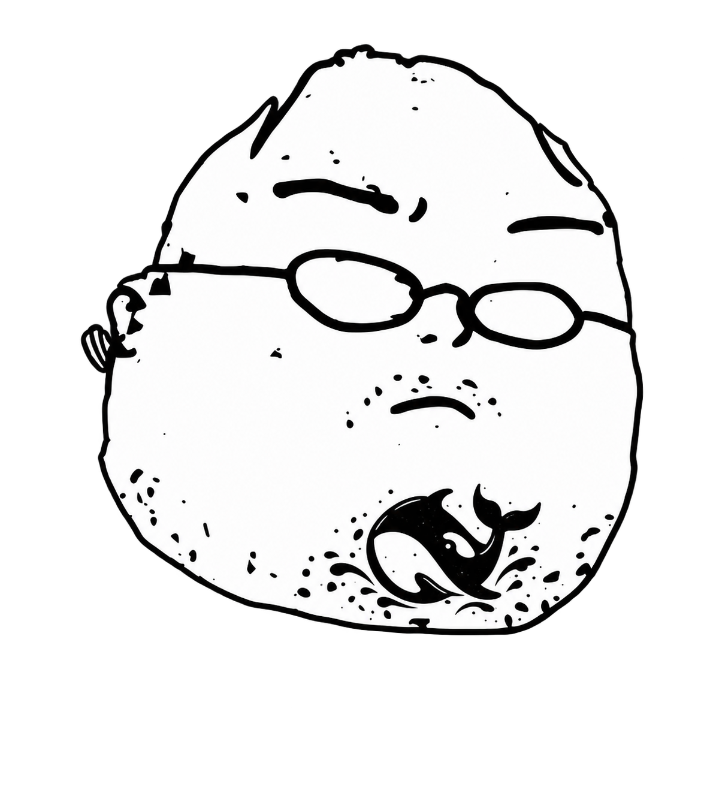

# dsh-ponytail

[English](./README.md) | [简体中文](./README.zh-CN.md)

[](https://www.npmjs.com/package/@wenaixi/dsh-ponytail)
[](./LICENSE)
[](https://github.com/deepseek-ai/deepseek-harness)
[](https://nodejs.org)
[](https://pnpm.io)

<p align="center">
  <br/>
  <em>The best code is the code you never wrote.</em>
</p>

A DeepSeek Harness (DSH) port of [DietrichGebert/ponytail](https://github.com/DietrichGebert/ponytail), maintained independently (ADR-0010). Injects the 7-rung ladder directly into system prompts, provides 6 specialized skills, and registers zero tools.

## What it is

A counter-weight to LLM boilerplate and over-engineering: deletion over addition, boring over clever, and fewest files possible. Challenge requirements before writing code (YAGNI), prioritize existing functions and standard libraries, and solve in one line when possible.

Features a **Zero Cache Miss Architecture** (ADR-0012): session baseline is locked permanently, and dynamic intensity switches take effect via turn-end reminders, leaving historical prompt / KV cache 100% untouched across long conversations. Ships as a pure `dsh.bundle`, writes zero garbage to your home root, uninstalls cleanly, and rebuilds itself through HMR.

## Install

Needs the DSH runtime (`npm i -g @deepseek-ai/dsh`). Node and pnpm floors are in the badges above. Examples use the `web` profile; substitute your own profile name.

```bash
# Install (automatic HMR reload)
dsh plugin --profile web add @wenaixi/dsh-ponytail

# Remove
dsh plugin --profile web remove @wenaixi/dsh-ponytail

# Inspect composed patch tree
dsh --profile web --dump-config | grep -A2 ponytail
```

`WARN missing peer @deepseek-ai/...` warnings are normal; peer dependencies are provided by the DSH host runtime. Seeing `Packages: +2 Done` indicates a successful install.

After running the install command, wait 2–3 seconds for the file watcher debounce period (Chokidar `awaitWriteFinish: true`), then refresh your browser. Manual editing of `cordis.patch.yml` is neither required nor recommended.

## Usage

```
/ponytail            Switch to full mode (all 7 rungs active)
/ponytail lite       Do the bare minimum
/ponytail ultra      Challenge the requirement itself first
/ponytail off        Disable injection
/ponytail default lite   Persist default across sessions
stop ponytail        Equivalent to off (exact match)
```

Intensity levels reset on each new session according to `env > Profile patch > fallback full`. Therefore, `/ponytail <level>` is session-scoped. To persist across restarts and new sessions, use `/ponytail default <level>`.

### Zero Cache Miss Architecture

When switching intensity levels within an ongoing session or updating global default configurations, the top-level SystemPrompt baseline remains **strictly byte-identical and static**. 

Mode transitions take effect dynamically by appending an incremental system notification (`<system-reminder>`) at the end of the current turn's user message (aligned with the official `dsh-tool-skill` catalog update pattern, ADR-0012). This **100% protects historical KV Cache / Prompt Cache** across all multi-turn conversation history, eliminating costly prefill recalculations and latency spikes.

## Skills

| Skill | Description |
|---|---|
| `/ponytail` | Core mode: 7-rung ladder, lazy senior dev mindset |
| `/ponytail-review` | Over-engineering code review: hunt for code that can be deleted |
| `/ponytail-audit` | Whole-repo complexity audit, ranked by deletion yield |
| `/ponytail-debt` | Harvest `ponytail:` comments into an actionable debt ledger |
| `/ponytail-gain` | Minimal metrics dashboard showing code reduction benchmarks |
| `/ponytail-help` | Quick reference card for modes, commands, and skills |

## Skill Bodies and Description Languages

Skill bodies are retrieved directly from upstream DietrichGebert/ponytail v4.10.3 in verbatim English. Two host-incompatible details are tailored for DSH: `ponytail-gain` data sources point to `assets/*.svg` (as upstream `benchmarks/` is excluded), and `ponytail-help` configuration and update sections reference profile patches and `dsh plugin`.

Model catalog views and configuration forms share the exact same description string, governed by `skillDescriptionLang` (three-state: explicit Chinese `zh` / explicit English `en` / unconfigured `auto`). When unconfigured, it follows the host's `locale.preference` (English triggers English alignment; others default to Chinese). Explicit selection locks the language. Canonical descriptions reside in `skills/descriptions.zh.json` and `skills/descriptions.en.json`, served live via `ctx.remote.ponytail.snapshot()`.

## Configuration Panel

The card detail view provides an embedded settings panel: intensity level control, independent toggle switches for all 6 skills, a one-click reset button, and a 3-tier priority diagnostic chain displaying environment variables, profile patches, and built-in fallbacks with their active hit states.

The level segmented control reflects only the actual persisted configuration. When `defaultMode` is not configured in the patch, the control highlights the appended `unset` segment. The currently active runtime level is displayed distinctly in the diagnostic header text.

Configuration reads and writes use two official DSH channels:

| Channel | Scope | Target |
|---|---|---|
| `ctx.configForms.get('ponytail')` | Default level & disabled skills with revision conflict checking | `profiles/<name>/cordis.patch.yml` |
| `ctx.remote.ponytail.snapshot()` | Active runtime level & 3-tier diagnostic chain (read-only) | In-memory RPC |

Profiles lacking a full UI service bundle (headless, CLI) fall back gracefully to `profiles/<name>/ponytail/config.json`. Legacy configurations from `$DSH_HOME/ponytail/config.json` are migrated once into profile patches upon initial boot and renamed to `.imported`.

## Upstream Mapping

The six hooks from upstream `hooks/` are consolidated into a single DSH Cordis plugin:

| Upstream | DSH Implementation |
|---|---|
| `ponytail-config.js` | `src/ponytail-config.ts` |
| `ponytail-instructions.js` | `src/ponytail-instructions.ts` (single entrypoint `renderPromptSection`) |
| `ponytail-state.js` | `src/ponytail-state.ts` (flag file I/O, session baseline manager, reload) |
| `ponytail-activate.js` | `src/ponytail.ts` (`agent/created` hook) |
| `ponytail-mode-tracker.js` | `src/ponytail-commands.ts` (`createCommandDispatcher`) |
| `ponytail-subagent.js` | `src/ponytail.ts` (`agent/created`, `PONYTAIL_SUBAGENT_MATCHER`) |

Prompts are injected via `systemPrompt.section('ponytail')` at `order: 50`, positioned neatly between `persona` (0) and tools (100). When switched to `off`, prompt rendering overhead is zero. Flags and configurations are scoped per profile directory, ensuring full multi-instance isolation.

## Development

```bash
pnpm typecheck              # tsc --noEmit
pnpm build                  # tsc into lib/, scripts/build-client.mjs generates lib/client.js
node scripts/verify.mjs     # Static contract gates: artifacts, skills, zero tools, slots, locales
node scripts/docs-verify.mjs # Documentation and version consistency gates
node scripts/behavior.test.mjs  # Behavioral test suite (104 tests pass)

dsh --profile web --patch ./cordis.patch.yml --dump-config  # Verify patch parsing
pnpm dsh web --patch ./cordis.patch.yml   # Hot reload dev runner
```

Local releases follow standard SemVer. Releases are triggered exclusively via git tags in CI. Push and tag operations require explicit authorization.

## License

[MIT](LICENSE), original by DietrichGebert, DSH port by Wenaixi. Upstream repository: https://github.com/DietrichGebert/ponytail
